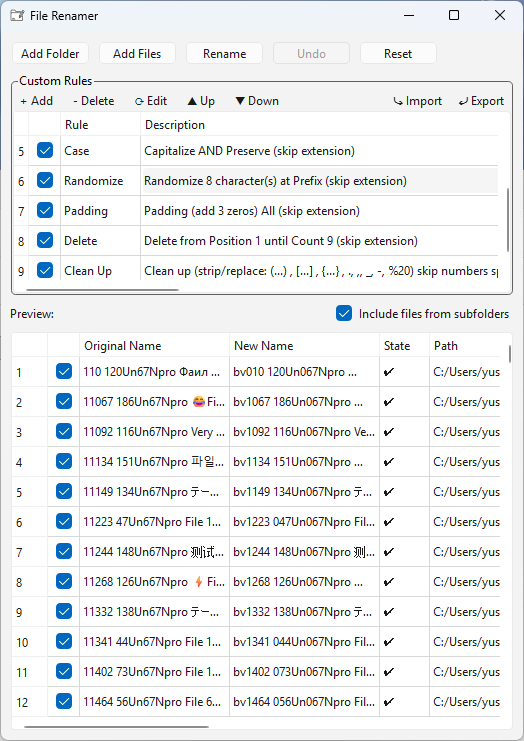
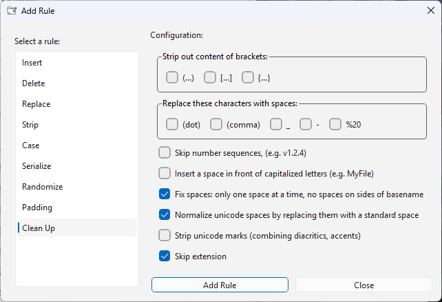

# File Renamer

A batch file renaming tool with a flexible rule system, preview, and multi-step pipeline processing.





## Features

### Insert
- Insert text at a specific position
- Replace the entire filename
- Support dynamic meta-tags

### Delete
- Delete by position
- Delete by delimiter
- Remove entire filename

### Replace
- Replace all / first / last occurrences
- Case-sensitive option
- Supports meta-tags

### Strip
- Remove letters / numbers / special characters
- Custom character filter
- Invert mode (keep selected characters only)
- Case-sensitive option

### Case Conversion
- Capitalize Every Word
- Capitalize and Preserve
- lowercase
- UPPERCASE
- Invert Case
- First letter capitalization

### Serialize
- Numbering: 001, 002, 003...
- Decimal / Alphabet / Roman numeral system
- Custom step value
- Reset per folder

### Randomize
- Random string generator
- Custom charset (a-z, 0-9, symbols)
- Adjustable length

### Padding
- Add leading zeros to numbers
- Remove leading zeros

### Clean Up
- Remove (), [], {}
- Replace special characters
- Split CamelCase
- Normalize whitespace
- Remove Unicode noise
- Fix extra spacing

## Features

### Preview System
- Shows old name → new name

### Validation System
- Rename is only allowed when all files are valid

### Rule System
- Multiple rules applied in sequence
- Pipeline-based processing (rule chaining)
- Enable / disable individual rules
- Quick rule modification

### Drag & Drop
- Drag and drop files/folders directly into the app
- Supports recursive folder scanning

### Undo
- Undo last rename operation
- Restore original filenames

### Export / Import Rules
- Export rules to JSON
- Import rules from JSON
- Easy sharing and backup of configurations

## Meta Tags

Supported meta-tags for dynamic naming:
- `{Date_Now}` - Current date
- `{Time_Now}` - Current time
- `{File_Size}` - File size
- `{File_FileName}` - Original filename
- `{File_Extension}` - File extension
- `{File_FolderName}` - Folder name
- `{File_FilePath}` - Full file path

# Download

Download the latest release from the [Releases page](https://github.com/yusteafy/batch-file-renamer/releases).

# Installation

## Option 1: Using Python + PyQt6 + PyInstaller

1. Install Python from [python.org](https://www.python.org/)

2. Install dependencies:
   ```bash
   pip install pyqt6 pyinstaller
   ```

3. Build application:
   ```bash
   pyinstaller --onefile --noconsole --icon=icon.ico main.py
   ```

## Option 2: Build from source (using uv)

1. Install uv from [astral.sh/uv](https://docs.astral.sh/uv/#__tabbed_1_2)

2. Clone the repository
   ```bash
   git clone https://github.com/yusteafy/batch-file-renamer
   ```

3. Navigate to the project directory then install dependencies
   ```bash
   uv sync
   ```

3. Run build script:
   ```bash
   build.bat
   ```